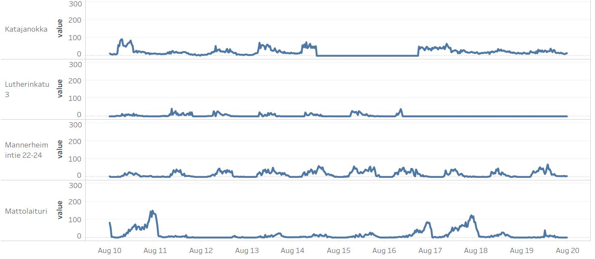
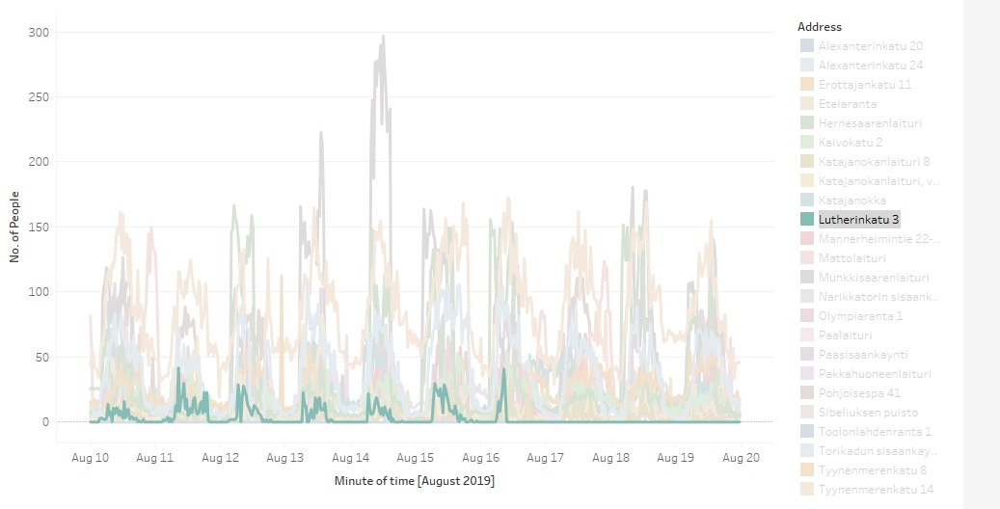

## Junction 2019

### Data Economics track
#### Business Finland: The DNA of Helsinki

##### Problem description (Given by Business Finland):

Dive into 1.7 billion data rows of pulsing heart of Helsinki city. Identify behavioural patterns, from real-life city scale environment. Find ways to advance the perception of how the city dynamics work. Improve the city experience that will benefit the people as well as the planet.

Explore a large data set of tourist movement from Port of Helsinki. Discover key interest locations and behavioural models. Find ways to analyse the people flow between key locations and areas, and ways to optimize city services for example for transportation.

##### Our Goal:

<i>Analyze</i> and <i>visualize</i> Helsinki's Geo-Human traffic data in order to help <i>generate insights</i> in an <i>objective manner</i>.

##### Project Description:

With the rise of machine learning and big data, everyone wants to make data-driven decisions to minimise loses and maximise gains. However, the multitude of data available in databases is often overwhelming for organisations and individuals to use them easily. Hence, there is a need to improve the accessibility of such data, through visualising and analysing, and allow individuals and organisations to generate objective insights from them.

This project aims to solve the above problem by utilising implementing a dashboard on Visualisation tool Tableau and predicting future data based on external dataset. Geo-human traffic data utilised were given by Business Finland as part of this hackathon. External dataset used is the Helsinki_weather_data.csv, which was also provided by Business Finland. 

The dashboard contains a visualisation of the different data collection stations, the number of people detected at each station over time, and graphical representation of human traffic for each specfic location. 

Future data prediction predicts the number of people at the stations the next day. This is done by doing a Time Series Regression using Holt-Winters' additive seasonal method and recursive feature elimination on a polynomial multiple regression model.

Through the dashboard prototype and prediction model created, the users can now have an easy understanding of the data's importance and limitations in decision-making.

Screenshot and demo:

Number of devices in a stations

A graph showing different stations with comparison to each other in 1 graph(focused on single station)

You can visit the following <a href="https://youtu.be/WsdZUr99Wi0">link</a> for a demo showing how the ML module works.
